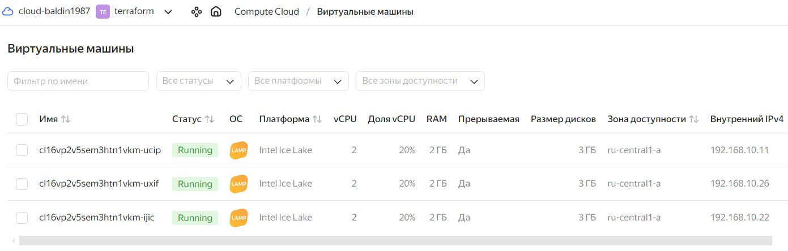
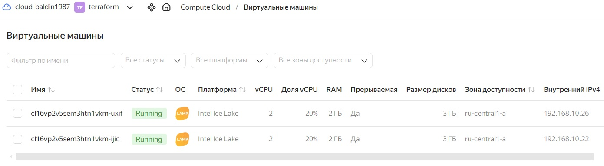
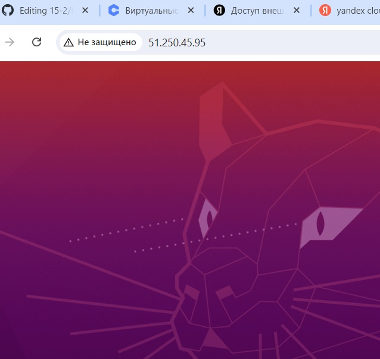

# Домашнее задание к занятию «Вычислительные мощности. Балансировщики нагрузки» - Балдин

### Подготовка к выполнению задания

1. Домашнее задание состоит из обязательной части, которую нужно выполнить на провайдере Yandex Cloud, и дополнительной части в AWS (выполняется по желанию). 
2. Все домашние задания в блоке 15 связаны друг с другом и в конце представляют пример законченной инфраструктуры.  
3. Все задания нужно выполнить с помощью Terraform. Результатом выполненного домашнего задания будет код в репозитории. 
4. Перед началом работы настройте доступ к облачным ресурсам из Terraform, используя материалы прошлых лекций и домашних заданий.

---
## Задание 1. Yandex Cloud 

**Что нужно сделать**

1. Создать бакет Object Storage и разместить в нём файл с картинкой:

 - Создать бакет в Object Storage с произвольным именем (например, _имя_студента_дата_).
 - Положить в бакет файл с картинкой.
 - Сделать файл доступным из интернета.
 
2. Создать группу ВМ в public подсети фиксированного размера с шаблоном LAMP и веб-страницей, содержащей ссылку на картинку из бакета:

 - Создать Instance Group с тремя ВМ и шаблоном LAMP. Для LAMP рекомендуется использовать `image_id = fd827b91d99psvq5fjit`.
 - Для создания стартовой веб-страницы рекомендуется использовать раздел `user_data` в [meta_data](https://cloud.yandex.ru/docs/compute/concepts/vm-metadata).
 - Разместить в стартовой веб-странице шаблонной ВМ ссылку на картинку из бакета.
 - Настроить проверку состояния ВМ.
 
3. Подключить группу к сетевому балансировщику:

 - Создать сетевой балансировщик.
 - Проверить работоспособность, удалив одну или несколько ВМ.
4. (дополнительно)* Создать Application Load Balancer с использованием Instance group и проверкой состояния.

Полезные документы:

- [Compute instance group](https://registry.terraform.io/providers/yandex-cloud/yandex/latest/docs/resources/compute_instance_group).
- [Network Load Balancer](https://registry.terraform.io/providers/yandex-cloud/yandex/latest/docs/resources/lb_network_load_balancer).
- [Группа ВМ с сетевым балансировщиком](https://cloud.yandex.ru/docs/compute/operations/instance-groups/create-with-balancer).

### Решение:

**Конфигурауция следующая:**

<details>
<summary>main.tf</summary>

```hcl
terraform {
  required_providers {
    yandex = {
      source = "yandex-cloud/yandex"
    }
  }
  required_version = ">=0.13"
}

provider "yandex" {
  service_account_key_file = var.service_account_key_file
  cloud_id                 = var.cloud_id
  folder_id                = var.folder_id
  zone                     = var.default_zone
}


resource "yandex_iam_service_account" "sa" {
  name = var.sa_name
}

resource "yandex_resourcemanager_folder_iam_member" "sa-editor" {
  folder_id = var.folder_id
  role      = "storage.editor"
  member    = "serviceAccount:${yandex_iam_service_account.sa.id}"
}

resource "yandex_resourcemanager_folder_iam_member" "editor" {
  folder_id = var.folder_id
  role      = "editor"
  member    = "serviceAccount:${yandex_iam_service_account.sa.id}"
}

resource "yandex_iam_service_account_static_access_key" "sa-static-key" {
  service_account_id = yandex_iam_service_account.sa.id
  description        = "static access key for object storage"
}

resource "yandex_storage_bucket" "baldin" {
  access_key = yandex_iam_service_account_static_access_key.sa-static-key.access_key
  secret_key = yandex_iam_service_account_static_access_key.sa-static-key.secret_key
  bucket     = var.bucket.name
  max_size   = var.bucket.max_size
  default_storage_class = var.bucket.storage_class
  anonymous_access_flags {
    read = true
    list = false
  }
}

resource "yandex_storage_object" "baldin" {
  depends_on = [yandex_storage_bucket.baldin]
  access_key = yandex_iam_service_account_static_access_key.sa-static-key.access_key
  secret_key = yandex_iam_service_account_static_access_key.sa-static-key.secret_key
  bucket     = var.bucket.name
  key        = var.bucket.key
  source     = var.bucket.file
}

data "template_file" "cloudinit" {
  template = file("./cloud-init.yml")
  vars = {
    username       = var.username
    ssh_public_key = file(var.ssh_public_key)
    packages       = jsonencode(var.packages)
  }
}

resource "yandex_compute_image" "lamp" {
  source_family = "lamp"
}

resource "yandex_vpc_network" "lamp_net" {
  name = var.vpc_name
}
resource "yandex_vpc_security_group" "lamp-sg" {
  name       = "lamp-sg"
  network_id = yandex_vpc_network.lamp_net.id

  egress {
    protocol       = "ANY"
    description    = "any"
    v4_cidr_blocks = ["0.0.0.0/0"]
  }

  ingress {
    protocol       = "TCP"
    description    = "ssh"
    v4_cidr_blocks = ["0.0.0.0/0"]
    port           = 22
  }
  ingress {
    protocol       = "TCP"
    description    = "ext-http"
    v4_cidr_blocks = ["0.0.0.0/0"]
    port           = 80
  }

  ingress {
    protocol       = "TCP"
    description    = "ext-https"
    v4_cidr_blocks = ["0.0.0.0/0"]
    port           = 443
  }
}

resource "yandex_vpc_subnet" "public" {
  name           = var.subnet_public
  zone           = var.default_zone
  network_id     = yandex_vpc_network.lamp_net.id
  v4_cidr_blocks = var.default_cidr

}

resource "yandex_compute_instance_group" "lamp-ig" {
  depends_on = [yandex_iam_service_account_static_access_key.sa-static-key]
  name                = "lamp-ig"
  folder_id           = var.folder_id
  service_account_id  = "${yandex_iam_service_account.sa.id}"
  deletion_protection = false
  instance_template {
    platform_id = var.vm_resources.platform_id
    resources {
      core_fraction = var.vm_resources.core_fraction
      cores         = var.vm_resources.cores
      memory        = var.vm_resources.memory
    }

    boot_disk {
      mode = var.vm_resources.boot_disk_mode
      initialize_params {
        image_id = yandex_compute_image.lamp.id
      }
    }
    scheduling_policy {
      preemptible = true
    }
    network_interface {
      subnet_ids          = [yandex_vpc_subnet.public.id]
      security_group_ids = [yandex_vpc_security_group.lamp-sg.id]
      nat                = false

    }

    metadata = {
      user-data = data.template_file.cloudinit.rendered
    }
  }
  scale_policy {
    fixed_scale {
      size = 3
    }
  }
  allocation_policy {
    zones = [var.default_zone]
  }

  deploy_policy {
    max_unavailable = 1
    max_expansion   = 0
  }

  load_balancer {
    target_group_name        = "lamp-group"
    target_group_description = "load balancer target group"
  }
}

resource "yandex_lb_network_load_balancer" "lamp-lb" {
  name = "lamp-lb"

  listener {
    name = "lamp-lb-listener"
    port = 80
    external_address_spec {
      ip_version = "ipv4"
    }
  }

  attached_target_group {
    target_group_id = yandex_compute_instance_group.lamp-ig.load_balancer.0.target_group_id

    healthcheck {
      name = "http"
      http_options {
        port = 80
        path = "/index.html"
      }
    }
  }
}
```

</details>


<details>
<summary>outputs.tf</summary>

```hcl
output "lb_ip" {
  value = yandex_lb_network_load_balancer.lamp-lb.listener
}
```

</details>

<details>
<summary>variables.tf</summary>

```hcl
variable "service_account_key_file" {
  type        = string
  default     = "authorized_key.json"
}

variable "cloud_id" {
  type    = string
  default = "b1gp0saejlr9tiitdtms"
}

variable "folder_id" {
  type    = string
  default = "b1gads94fhccurj7j4uk"
}

variable "default_zone" {
  type        = string
  default     = "ru-central1-a"
}

variable "default_cidr" {
  type        = list(string)
  default     = ["192.168.10.0/24"]
}

variable "private_cidr" {
  type        = list(string)
  default     = ["192.168.20.0/24"]
}

variable "vpc_name" {
  type        = string
  default     = "netology"
}

variable "subnet_public" {
  type        = string
  default     = "public"
}

variable "subnet_private" {
  type        = string
  default     = "private"
}

variable "public_key" {
  type    = string
  default = ""
}

variable "username" {
  type    = string
  default = "baldin"
}

variable "ssh_public_key" {
  type    = string
  default = "path/to/key"
}

variable "packages" {
  type    = list(any)
  default = []
}

variable "vm_resources" {
  type = map(any)
  default = {
    cores         = 2
    memory        = 2
    core_fraction = 20
    boot_disk_mode = "READ_WRITE"
    platform_id = "standard-v3"
  }
}

variable "sa_name" {
  type = string
  default = "service-acc-2"
}

variable "bucket" {
  type = map(any)
  default = {
    name = "baldin-bucket-hw-15-2"
    max_size  = "1073741824"
    storage_class = "STANDARD"
    key = "netology.jpg"
    file = "netology.jpg"
  }
}
```

</details>

<details>
<summary>outputs.tf</summary>

```hcl
users:
  - name: ${username}
    groups: sudo
    shell: /bin/bash
    sudo: ['ALL=(ALL) NOPASSWD:ALL']
    ssh_authorized_keys:
      - ${ssh_public_key}

bootcmd:
  - echo '<p>hostname is:' "$(hostname)" '</p><br><a href="https://storage.yandexcloud.net/baldin-bucket-hw-15-2/netology.jpg">Link</a>' >  /var/www/html/index.html
```

</details>

**Проверяем:**

**Бакет:**

```bash
root@kube-test:/home/baldin/cloud-15-2-2# yc storage bucket list
+-----------------------+----------------------+------------+-----------------------+---------------------+
|         NAME          |      FOLDER ID       |  MAX SIZE  | DEFAULT STORAGE CLASS |     CREATED AT      |
+-----------------------+----------------------+------------+-----------------------+---------------------+
| baldin-bucket-hw-15-2 | b1gads94fhccurj7j4uk | 1073741824 | STANDARD              | 2024-08-20 20:31:59 |
+-----------------------+----------------------+------------+-----------------------+---------------------+
```

**Статус балансировщика:**

```bash
root@kube-test:/home/baldin/cloud-15-2-2# yc load-balancer network-load-balancer list
+----------------------+---------+-------------+----------+----------------+------------------------+--------+
|          ID          |  NAME   |  REGION ID  |   TYPE   | LISTENER COUNT | ATTACHED TARGET GROUPS | STATUS |
+----------------------+---------+-------------+----------+----------------+------------------------+--------+
| enpv45cms4am3hjqec8r | lamp-lb | ru-central1 | EXTERNAL |              1 | enp8prfsmgkkhq9s41c4   | ACTIVE |
+----------------------+---------+-------------+----------+----------------+------------------------+--------+
```

**Созданные ВМ:**



**Внешний IP:**

```bash
root@kube-test:/home/baldin/cloud-15-2-2# terraform output
lb_ip = toset([
  {
    "external_address_spec" = toset([
      {
        "address" = "51.250.45.95"
        "ip_version" = "ipv4"
      },
    ])
    "internal_address_spec" = toset([])
    "name" = "lamp-lb-listener"
    "port" = 80
    "protocol" = "tcp"
    "target_port" = 80
  },
])
```

**Проверяем работоспособность при удалении ВМ. Удалили одну ВМ:**



**Балансировщик чувствует себя хорошо:**

```bash
root@kube-test:/home/baldin/cloud-15-2-2# yc compute instance list
+----------------------+---------------------------+---------------+---------+-------------+---------------+
|          ID          |           NAME            |    ZONE ID    | STATUS  | EXTERNAL IP |  INTERNAL IP  |
+----------------------+---------------------------+---------------+---------+-------------+---------------+
| fhmfi5p829pv2j7skp18 | cl16vp2v5sem3htn1vkm-uxif | ru-central1-a | RUNNING |             | 192.168.10.26 |
| fhmjjkt4ldij80kr932j | cl16vp2v5sem3htn1vkm-ijic | ru-central1-a | RUNNING |             | 192.168.10.22 |
+----------------------+---------------------------+---------------+---------+-------------+---------------+

root@kube-test:/home/baldin/cloud-15-2-2# yc load-balancer network-load-balancer target-states --id enpv45cms4am3hjqec8r --target-group-id enp8prfsmgkkhq9s41c4
+----------------------+---------------+-----------+
|      SUBNET ID       |    ADDRESS    |  STATUS   |
+----------------------+---------------+-----------+
| e9bmdcb1r5t58ecnbqm1 | 192.168.10.11 | UNHEALTHY |
| e9bmdcb1r5t58ecnbqm1 | 192.168.10.22 | HEALTHY   |
| e9bmdcb1r5t58ecnbqm1 | 192.168.10.26 | HEALTHY   |
+----------------------+---------------+-----------+

root@kube-test:/home/baldin/cloud-15-2-2# yc load-balancer network-load-balancer list
+----------------------+---------+-------------+----------+----------------+------------------------+--------+
|          ID          |  NAME   |  REGION ID  |   TYPE   | LISTENER COUNT | ATTACHED TARGET GROUPS | STATUS |
+----------------------+---------+-------------+----------+----------------+------------------------+--------+
| enpv45cms4am3hjqec8r | lamp-lb | ru-central1 | EXTERNAL |              1 | enp8prfsmgkkhq9s41c4   | ACTIVE |
+----------------------+---------+-------------+----------+----------------+------------------------+--------+
```

**Картина доступна по внешнему IP:**


